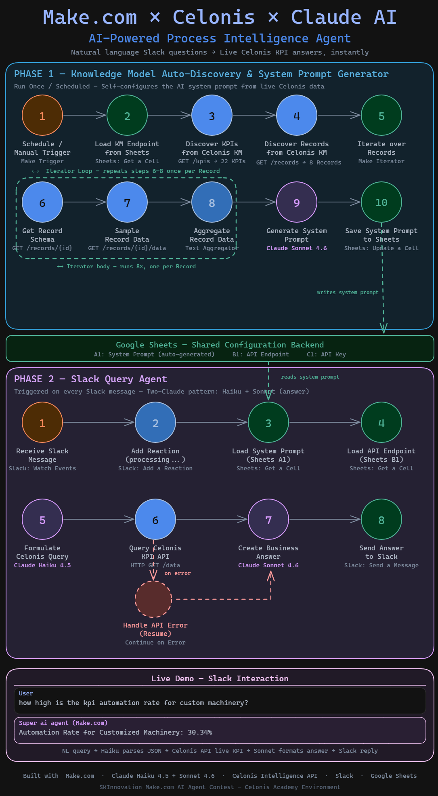

# Make.com × Celonis × Claude AI
### AI-Powered Process Intelligence Agent

> Ask natural language questions about your Celonis O2C KPIs — get instant answers in Slack, powered by Claude AI and Make.com.



---

## 💡 What is this?

Instead of logging into the Celonis Platform to manually check KPIs, a user simply sends a message in Slack:

```
User:  "What is the rework rate for Customized Machinery?"
Agent: "Automation Rate for Customized Machinery: 30.34%"
```

The system consists of **two Make.com scenarios** that work together:

| Phase | Scenario | Purpose |
|-------|----------|---------|
| **Phase 1** | KM Auto-Discovery & System Prompt Generator | Self-configures the AI from live Celonis data |
| **Phase 2** | Slack Query Agent | Answers natural language KPI questions in real-time |

Both scenarios communicate via **Google Sheets** as a lightweight configuration backend.

---

## 🏗️ Architecture

### Phase 1 — Knowledge Model Auto-Discovery
*Run once, on a schedule, or triggered via Webhook*

```
Trigger → Load KM Endpoint → Discover KPIs → Discover Records
        → Iterate over Records → Get Record Schema → Sample Record Data
        → Aggregate Data → Claude Sonnet (Generate System Prompt)
        → Save to Google Sheets
```

| Step | Node | Action |
|------|------|--------|
| 1 | ⏰ Trigger | Manual / Scheduled / Webhook |
| 2 | 🔗 Load KM Endpoint | Reads Celonis KM URL from Google Sheets |
| 3 | 📊 Discover KPIs | `GET /kpis` → all KPI IDs, names, formats |
| 4 | 🗂️ Discover Records | `GET /records` → all Record IDs |
| 5 | 🔄 Iterate over Records | Iterator loops over each Record |
| 6 | 🔍 Get Record Schema | `GET /records/{id}` → field definitions |
| 7 | 📋 Sample Record Data | `GET /records/{id}/data` → real sample values |
| 8 | 📦 Aggregate Data | Text Aggregator combines all data |
| 9 | 🧠 Generate System Prompt | Claude Sonnet generates tailored system prompt |
| 10 | 💾 Save to Sheets | System prompt saved to Google Sheets A1 |

---

### Phase 2 — Slack Query Agent
*Triggered on every Slack message*

```
Slack Message → Load Config → Claude Haiku (Parse Query)
             → Celonis KPI API → Claude Sonnet (Create Answer)
             → Slack Reply
```

| Step | Node | Action |
|------|------|--------|
| 1 | 📨 Receive Slack Message | Slack trigger captures question + channel ID |
| 2 | ➕ Add Reaction | Adds "processing..." reaction to message |
| 3 | 📋 Load System Prompt | Reads auto-generated prompt from Sheets A1 |
| 4 | 🔗 Load API Endpoint | Reads Celonis KM URL from Sheets B1 |
| 5 | 🧠 Formulate Celonis Query | Claude Haiku → structured JSON with `kpis` + `filterExpr` |
| 6 | 📡 Query Celonis KPI API | `HTTP GET /data?kpis=...&filterExpr=...` → live values |
| 7 | ⚠️ Handle API Error | Continue on Error handler |
| 8 | 💡 Create Business Answer | Claude Sonnet → formatted answer with insights |
| 9 | 📤 Send Answer to Slack | Posts answer back to Slack channel |

---

## ⚙️ Configuration — Google Sheets

| Cell | Content | Written By |
|------|---------|-----------|
| `A1` | Auto-generated System Prompt | Phase 1 (Claude Sonnet) |
| `B1` | Celonis Knowledge Model API Endpoint URL | Manual setup |
| `C1` | Celonis API Key (Bearer Token) | Manual setup |

> **Note:** Google Sheets is used for simplicity. In production, replace with PostgreSQL, a Make.com Data Store, or a secrets manager.

---

## 🤖 Claude AI Configuration

| Node | Model | Max Tokens | Temperature | Purpose |
|------|-------|-----------|-------------|---------|
| Formulate Query | `claude-haiku-4-5` | 500 | 0.2 | Parse NL → JSON (fast, cheap, deterministic) |
| Generate System Prompt | `claude-sonnet-4-6` | 3000 | 1.0 | Build system prompt from KM data |
| Create Answer | `claude-sonnet-4-6` | 5000 | 0.4 | Business-readable KPI analysis |

---

## 🔗 Celonis Intelligence API

The project uses the Celonis Intelligence API to query Knowledge Model data:

```
GET /kpis                          → all KPI metadata
GET /records                       → all Record IDs
GET /records/{id}                  → field definitions
GET /records/{id}/data             → sample values
GET /data?kpis=...&filterExpr=...  → live KPI values (Phase 2)
```

### Verified filterExpr Syntax
```
INDUSTRY.FMCG_RETAIL eq 'Beer'
INDUSTRY.MANUFACTURING ne null
CEL_O2C_ACTIVITIES.ACTIVITY_EN eq 'Ship Goods'
```

---

## 📋 Requirements

| Requirement | Details |
|------------|---------|
| Celonis Platform | Account with published Knowledge Model + API Key |
| Make.com | Free or paid plan |
| Slack | Workspace + Bot (`chat:write`, `channels:history` scopes) |
| Google Sheets | One sheet with 3 configured cells |
| Anthropic API | Via Make's native Claude module |

---

## 🚀 Setup

1. **Google Sheets** — Create a sheet, enter your Celonis KM endpoint in `B1` and API key in `C1`
2. **Slack Bot** — Create a Slack app with `chat:write` and `channels:history` permissions
3. **Phase 1** — Import the scenario, connect Google Sheets + Celonis, run once to generate the system prompt
4. **Phase 2** — Import the scenario, connect Slack + Google Sheets, activate

---

## 🔄 Trigger Options for Phase 1

| Trigger | When to Use |
|---------|------------|
| Manual | Initial setup or one-off refresh |
| Scheduled | Daily/weekly when KM data changes regularly |
| Webhook | Trigger remotely from any external system |
| Make MCP | Update system prompt on demand from Claude Desktop |

---

## 📎 Make.com Scenarios

| Scenario | Link |
|----------|------|
| Phase 1 — KM Auto-Discovery | [Setup / Update Knowledge Model](https://eu1.make.com/public/shared-scenario/V62YN9gT2ZW/setup-update-knowledge-about-database) |
| Phase 2 — Slack Query Agent | [Slack Data Model Analyst](https://eu1.make.com/public/shared-scenario/BwfyXfrs6pP/slack-data-model-analyst) |

---

## 🗺️ Architecture Diagram

Full Excalidraw architecture diagram included in this repo (`excalidrawExplanation.png`).

---

## 💭 Design Philosophy

> *Keep it simple. Make it work. Make it useful. Don't over-engineer.*

This was built as a student project for the **SKInnovation Make.com AI Agent Contest** in a Celonis Academy environment. The goal was a functional, practical prototype — not a production system. Extensions like PostgreSQL, conversation memory, or multi-KM support are possible but deliberately out of scope here.

---

## 🛠️ Built With

`Make.com` · `Claude Haiku 4.5` · `Claude Sonnet 4.6` · `Celonis Intelligence API` · `Slack` · `Google Sheets`
